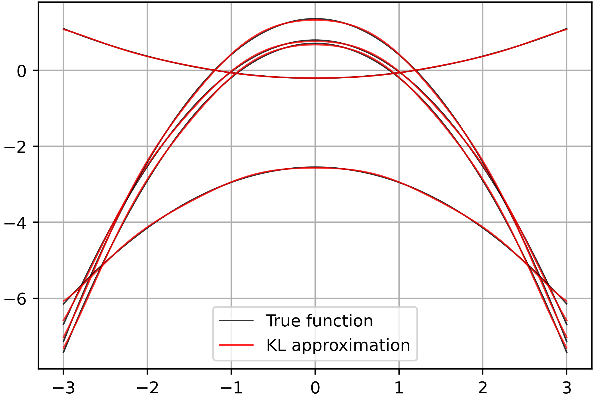

<h1 align="center">Karhunen-Loève expansion</h1>


Python implementation of the Karhunen-Loève expansion, with parallelism
over the evaluation of the eigenfunctions, for approximating stochastic
processes via a set of eigenfunctions. This is useful for separating the
space-time components of stochastic processes from their stochastic
components. The implementation is based on the following paper:

```bibtex
@inproceedings{
phillips2022spectral,
title={Spectral Diffusion Processes},
author={Angus Phillips and Thomas Seror and Michael John Hutchinson 
    and Valentin De Bortoli and Arnaud Doucet and Emile Mathieu},
booktitle={NeurIPS 2022 Workshop on Score-Based Methods},
year={2022},
url={https://openreview.net/forum?id=bOmLb2i0W_h}
}
```





## Installation

Run the commands below to install the required packages.

```bash
git clone https://github.com/alisiahkoohi/kl-expansion
cd kl-expansion/
conda env create -f environment.yml
conda activate klexp
pip install -e .
```

After the above steps, you can run the example scripts by just
activating the environment, i.e., `conda activate klexp`, the
following times.

## Usage

To run the example scripts, you can use the following commands.

```bash
python scripts/kl-expansion-toy-example.py --x_range [-10,10] --M 20 --num_workers 8
```
## Questions

Please contact alisk@rice.edu for questions.

## Author

Ali Siahkoohi and Lorenzo Baldassari